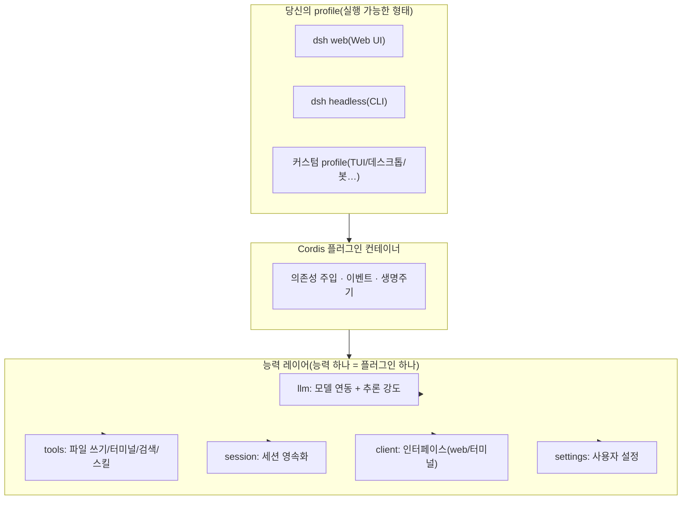

# 제 1 장: DeepSeek Harness 이해하기

> 본 장의 목표: 완전히 사전 지식이 없는 상태에서 DeepSeek Harness(dsh)에 대한 완전한 인지를 구축합니다 —— **그것이 무엇인지, 왜 배울 가치가 있는지, 주류 Agent와 무엇이 다른지, 언제 써야 하는지**. 이 장을 다 읽으면 어떤 사전 지식 없이도 dsh가 전체 AI 개발 도구 지형에서 어디에 위치하는지 이해할 수 있습니다.

## TL;DR(본 장 핵심, 30초 버전)

1. **dsh = Agent의 레고 베이스플레이트**: 공식 오픈소스(MIT) 런타임으로, 모든 능력이 플러그인이며 자유롭게 조립할 수 있습니다
2. **harness = 모델 바깥의 엔지니어링 레이어**: 세션, 도구, 컨텍스트, 루프 제어 —— 모델이 저장소 안에서 실제로 일할 수 있게 만듭니다
3. **Claude Code와의 차이**: Claude Code는 "완성차"이고, dsh는 "베이스플레이트 + 블록"입니다 —— 커스터마이즈 가능한 범위가 완전히 다릅니다
4. **생태계 창구**: 2026-08-13 오픈소스 공개, 그 이전 한국어(중국어) 튜토리얼은 전무 —— 지금 진입하는 것은 초기 단계입니다
5. **누가 써야 하나**: 깊은 커스터마이징/생태계 참여/CI 실행이 필요한 개발자; 바로 쓸 수 있는 것을 원한다면 Claude Code를 선택하세요

<details><summary>본 장 목차</summary>
- [1.1 먼저 세 가지 직관 세우기](#11-먼저-세-가지-직관-세우기)
- [1.2 공식 정의와 핵심 사실](#12-공식-정의와-핵심-사실)
- [1.3 아키텍처는 어떻게 "모든 것이 플러그인"이 되는가](#13-아키텍처는-어떻게-모든-것이-플러그인이-되는가)
- [1.4 DSH와 주류 Agent의 전면 비교](#14-dsh와-주류-agent의-전면-비교)
- [1.5 언제 dsh를 써야 하는가(도구 선택 결정)](#15-언제-dsh를-써야-하는가도구-선택-결정)
- [1.6 자주 묻는 질문(FAQ)](#16-자주-묻는-질문faq)
</details>

## 1.1 먼저 세 가지 직관 세우기

기술을 설명하기 전에, 먼저 세 가지 비유로 직관을 세워봅시다:

**① dsh는 무엇인가? —— "Agent의 레고 베이스플레이트"입니다.**
레고를 떠올려보세요: 공식이 베이스판과 표준 블록(런타임 + 핵심 플러그인)을 제공하면, 여러분은 자유롭게 조립합니다(플러그인 추가, 인터페이스 교체, 동작 변경). 이에 비해 Claude Code는 "완성차"에 더 가깝습니다 —— 운전하기는 편하지만 엔진을 개조하려면 제조사를 찾아가야 합니다.

**② 왜 "harness"라는 단어가 필요한가? —— "모델 바깥을 감싸는 엔지니어링 레이어"이기 때문입니다.**
모델(DeepSeek V4) 자체는 "텍스트로 답변하는" 것밖에 하지 못합니다. 모델이 여러분의 코드 저장소 안에서 실제로 일하게(파일 읽기, 명령 실행, 코드 수정, 다회차 루프) 하려면, 바깥에 한 층의 엔지니어링이 필요합니다: 세션 관리, 도구 호출, 컨텍스트 제어, 오류 복구. **이 엔지니어링 레이어를 harness라고 부릅니다.** dsh는 DeepSeek 공식이 이 엔지니어링 레이어를 오픈소스로 공개한 제품입니다.

**③ 왜 2026년에야 오픈소스로 공개했는가? —— Agent가 "프로그래머블 시대"에 진입했기 때문입니다.**
2025년은 "모델 성능 경쟁"(누가 더 좋은 코드를 생성하는가)의 해였고, 2026년은 "Agent 엔지니어링 경쟁"(누가 모델을 더 잘 조직해 일을 시키는가)의 해로 진입합니다. DeepSeek가 harness를 오픈소스로 공개한 전략적 의도는: **"어떻게 Agent를 조직할 것인가"라는 문제를 개방된 생태계로 만드는 것**입니다 —— 마치 예전 Android가 오픈소스로 스마트폰 생태계를 바꾼 것처럼요.

## 1.2 공식 정의와 핵심 사실

**한 줄 정의**: DeepSeek Harness(`dsh`)는 DeepSeek 공식이 오픈소스로 공개한 Agent 런타임으로, "모든 것이 플러그인"(everything is a plugin) 아키텍처를 채택했으며 Cordis 플러그인 컨테이너를 기반으로 구축되었습니다.

| 사실 | 내용 |
|---|---|
| 오픈소스 공개일 | 2026-08-13 |
| 라이선스 | MIT(상업적 이용 가능, 수정 가능) |
| 언어 | TypeScript(Node.js ≥ 22) |
| 버전 라인 | `0.1.0-rc.x`(현재 rc.6, 빠른 반복 주기, 공식이 "파괴적 변경이 있을 것"이라고 명시) |
| 하부 구조 | [Cordis](https://github.com/cordiverse/cordis)(조합 가능한 플러그인 컨테이너) |
| 내장 형태 | `web`(Web UI) + `headless`(일회성 CLI) |
| 공식 포지셔닝 | 공식 README 원문: "everything is a plugin" |

## 1.3 아키텍처는 어떻게 "모든 것이 플러그인"이 되는가



### 레이어 뷰

```text
┌──────────────────────────────────────────────┐
│  당신의 profile(실행 가능한 형태)              │
│  = bundle 스택 + 당신의 patch 레이어           │
│  · dsh web(Web UI 형태)                       │
│  · dsh headless(CLI 형태)                     │
│  · 당신의 커스텀 profile(TUI/데스크톱/봇…)     │
├──────────────────────────────────────────────┤
│  능력 레이어(능력 하나 = 플러그인 하나)         │
│  · llm: 모델 연동(DeepSeek V4 계열 + 추론 강도) │
│  · tools: 도구(파일 쓰기/터미널/검색/스킬…)     │
│  · session: 세션 영속화                        │
│  · client: 인터페이스(web 브라우저 반쪽 / 터미널 반쪽) │
│  · settings: 사용자 설정                       │
│  …(공식 패키지 60+개)                          │
├──────────────────────────────────────────────┤
│  Cordis 플러그인 컨테이너: 로딩, 의존성 주입, 이벤트, 생명주기 │
└──────────────────────────────────────────────┘
```

### 반드시 알아야 할 세 가지 개념

**① profile(실행 가능한 형태)**
하나의 profile = `$DSH_HOME/profiles/<name>/` 디렉터리이며, 다음을 포함합니다:
- `package.json`: 플러그인 의존성 + 매니페스트(`dsh.profile.bundles`가 bundle 순서를 지정)
- `cordis.patch.yml`: 당신의 patch 레이어(플러그인 장착/오버라이드)
시작 시 순서대로 합성됩니다: 내장 bundle → profile patch → 전역 patch → `--patch` 오버라이드.

**② host 반쪽 / client 반쪽(플러그인 하나, 두 개의 얼굴)**
| 반쪽 | 어디서 실행되는가 | 무엇을 하는가 |
|---|---|---|
| host 반쪽 | Node 프로세스 | 도구, 서비스, 이벤트, 파일 시스템 —— `apply(ctx)`로 등록 |
| client 반쪽 | 브라우저(web profile) | UI, 상호작용 —— `package.json`의 `dsh.client`로 선언 |

npm 패키지 하나가 두 반쪽을 동시에 가질 수 있습니다(`exports["."]` + `exports["./client"]`).

**③ 확장 포인트(extension point)**
공식 원칙: "**Plugins, not loop changes**" —— 동작을 바꾸려면 공식 훅을 먼저 쓰고, 코어를 fork하지 마세요. 자주 쓰는 확장 포인트(이후 장에서 하나씩 실습):
- `agent/request` waterfall: 매 모델 요청 전에 설정 변경(도구 호출 속도 개선 플러그인의 훅 지점)
- `conversationEvents.register`: 대화 이벤트 구독/주입
- `ctx.slots.inject`: 인터페이스 슬롯에 UI 주입
- `settings` 서비스: 사용자가 설정 가능한 항목 등록

## 1.4 DSH와 주류 Agent의 전면 비교

### 능력 매트릭스(핵심 6개사)

| 항목 | **dsh** | Claude Code | OpenAI Codex | OpenCode | Gemini CLI | Kimi CLI |
|---|---|---|---|---|---|---|
| 오픈소스 | ✅ MIT | ❌ 클로즈드소스 | ❌ 클로즈드소스 | ✅ MIT | ❌ 클로즈드소스 | ❌ 클로즈드소스 |
| 모델 종속 | 모델 독립적(공식은 DeepSeek 지원) | Claude 계열 | GPT 계열 | 임의 | Gemini 계열 | Kimi 계열 |
| 공식 런타임 | ✅(web + headless + 플러그인 생태계) | 제품이 곧 런타임 | 제품이 곧 런타임 | 클라이언트(공식 백엔드 없음) | 제품이 곧 런타임 | 제품이 곧 런타임 |
| **플러그인 체계** | **공식 레벨: 모든 것이 플러그인, 공식 패키지 60+개** | 설정/훅 위주 | 설정 위주 | 설정 위주 | 없음 | 없음 |
| 커스텀 UI | ✅(client 반쪽 = 자유로운 UI) | ❌ | ❌ | 일부(TUI 고정) | ❌ | ❌ |
| 자동화/CI | ✅ headless profile | ✅ | ✅ | ✅ | ✅ | ✅ |
| TUI | 플러그인으로 가능(공식 미내장) | ✅ 내장 | ✅ 내장 | ✅ 내장 | ✅ | ✅ |
| 생태계 단계 | 초일부터 시작(2026-08-13) | 성숙 | 성숙 | 성숙 | 성숙 | 초기 |
| 적합한 대상 | **깊은 커스터마이징 + 생태계 참여를 원하는 개발자** | 바로 사용 | 바로 사용 | OpenCode에 익숙한 사용자 | Google 생태계 | Kimi 생태계 |

### 그 외 주류 Agent 훑어보기(한 줄 포지셔닝)

| Agent | 한 줄 포지셔닝 | dsh와의 핵심 차이 |
|---|---|---|
| **Cursor** | IDE 내장형 AI 코딩 어시스턴트(Composer/Agent 모드) | IDE에 깊게 종속; dsh는 독립 런타임으로 어떤 에디터/터미널에도 배치 가능 |
| **Amp** | 터미널 네이티브, 에이전트 우선 AI 코딩 agent | 경량 터미널 형태; dsh는 공식 백엔드 + 플러그인 생태계가 추가됨 |
| **Devin** | 클라우드 "AI 소프트웨어 엔지니어"(독립 작업/브라우저/워크스페이스) | 클라우드에 호스팅; dsh는 로컬 실행, 데이터가 로컬을 벗어나지 않음 |
| **Windsurf** | IDE 내장형 코딩 agent(Flow/Agent 모드) | Cursor와 동일, IDE에 종속 |
| **Aider** | 오픈소스, Git 우선의 터미널 페어 프로그래밍 agent | "코드 수정 + git"에 집중; dsh는 범용 런타임 |
| **Qwen Code** | 알리바바 통이(通义) coding agent CLI(DeepSeek provider 내장) | Qwen 모델 위주; dsh는 공식이 DeepSeek을 지원하며 플러그인화되어 있음 |
| **GLM CLI** | 지푸(智谱) coding agent CLI | GLM 모델 위주; dsh는 모델 독립적 + 플러그인 생태계 |
| **Grok CLI** | xAI 터미널 coding agent | Grok 모델 위주 |

> 결론: 주류 agent는 대체로 세 가지로 나뉩니다 —— **IDE 내장형**(Cursor/Windsurf), **터미널 코딩 어시스턴트**(Codex/OpenCode/Aider/Qwen Code/GLM CLI/Grok CLI), **런타임/플랫폼**(dsh/Devin). dsh는 현재 유일하게 "공식 오픈소스 + 모델 독립적 + 플러그인 생태계"를 갖춘 런타임형 선수입니다.

### 쉬운 말로: 각 회사는 무엇이고, 누구에게 적합하며, dsh와 무엇이 다른가

**Claude Code(Anthropic)**: 현재 가장 성숙한 터미널 코딩 어시스턴트입니다. 바로 사용 가능하고, TUI 경험이 좋고, 생태계가 성숙합니다 —— **당장 일을 시작하고 싶은 사람에게 적합**합니다. 단점: 클로즈드소스, Claude 모델에 종속, 커스터마이징 여지가 제한적(설정/훅만 가능). dsh와 비교하면: dsh가 바꿀 수 있는 것들(인터페이스/도구 체인/백엔드)을 Claude Code는 바꿀 수 없지만, dsh의 "바로 사용 가능함"은 아직 Claude Code에 못 미칩니다.

**OpenAI Codex**: OpenAI의 터미널 agent입니다. 엔지니어링 능력이 강하고 GPT 계열 모델의 지원을 받습니다. 마찬가지로 클로즈드소스에 종속됩니다. dsh와 비교하면: 능력 라인은 비슷하지만 dsh는 오픈소스로 자유롭게 수정 가능합니다.

**OpenCode**: 오픈소스, 터미널, 임의의 모델을 설정할 수 있음 —— dsh와 가장 닮은 "이웃"입니다. 핵심 차이: **OpenCode는 공식 백엔드 런타임이 없습니다**(클라이언트 + 설정에 불과), dsh는 공식 bundle + 60+개 패키지 + 플러그인 생태계를 갖추고 있어 커스터마이즈 가능 범위가 더 깊습니다. **OpenCode 사용자라면 dsh로 옮겨가는 비용이 매우 낮습니다**(개념이 비슷함).

**Gemini CLI**: Google의 터미널 agent입니다. 긴 컨텍스트/멀티모달이 강점입니다(Gemini 모델의 장점). Google 생태계에 종속됩니다.

**Kimi CLI**: 문샷 AI(月之暗面)의 터미널 agent입니다. 중국어 시나리오에 강하고 Kimi 모델의 지원을 받습니다. 생태계는 초기 단계입니다.

**Cursor / Windsurf**: IDE 내장형 —— 이들의 장점은 "에디터 안에서 바로 사용"이고, 단점은 **IDE에 갇힌다**는 것입니다. dsh는 독립 런타임으로, 어떤 환경(터미널/CI/서버/향후 TUI)에서도 동일한 agent 능력을 사용할 수 있습니다.

**Devin**: 클라우드 엔지니어 —— 작업을 주면 클라우드에서 일을 처리합니다. 장점은 호스팅되며 브라우저가 있다는 것; 단점은 **데이터가 로컬을 벗어나고**, 비용이 높다는 것입니다. dsh는 로컬에서 실행되어 프라이버시를 제어할 수 있습니다.

**Aider**: 오래된 오픈소스, Git 우선, 경량입니다. "AI가 코드 수정만 도와주면 되는" 미니멀리스트에게 적합합니다. dsh는 더 무거운 런타임입니다 —— Aider가 하는 일만 필요하다면 Aider로 충분하고, Agent 시스템을 만들고 싶다면 dsh가 베이스가 됩니다.

**Qwen Code / GLM CLI / Grok CLI**: 각 회사 모델의 터미널 agent —— 모델 종속은 이들의 자연스러운 속성입니다. dsh는 모델 독립적(공식은 DeepSeek을 지원하며 OpenAI 호환 모델도 연결 가능)이라 "모델을 바꿀 수 있음"을 원하는 사람에게 더 적합합니다.

### 그림 한 장으로 이해하는 dsh의 차별화 포지션

```text
커스터마이징 깊이(바꿀 수 있는 것)
   高 │            dsh(런타임 + 플러그인 생태계)
      │
      │    자체 구축 프레임워크(LangGraph 등)
      │
      │    OpenCode(클라이언트 + 설정)
      │
   低 │    Claude Code / Codex / Gemini / Kimi(제품이 곧 런타임)
      └──────────────────────────────────────
       低            바로 사용 가능한 정도            高
```

- **우상단**: dsh —— 커스터마이즈 가능 범위가 가장 크지만, "바로 사용 가능함"은 생태계로 보완해야 함
- **좌상단**: 자체 구축 프레임워크 —— 완전히 자유롭지만 전부 직접 구축해야 함
- **우하단**: 제품형 agent —— 가장 쓰기 편하지만 가장 폐쇄적임

### 사례 비교: 같은 작업, 다른 접근 방식

**작업**: Agent가 저장소 안에서 "특정 함수를 호출하는 모든 곳을 찾아 파라미터 하나를 통일해서 바꾸도록" 시키기.

| Agent | 어떻게 하는가 | 경험 |
|---|---|---|
| **dsh(web)** | `dsh web` → 지시 입력 → 모델이 Grep/Read/Edit 도구로 완료 | Web UI + 우측 플러그인 사이드바(Git 패널 추가 가능) |
| **dsh(headless)** | `dsh --profile headless "작업"` → 결과 출력 후 종료 | **CI에 넣을 수 있음**: 0이 아닌 종료 코드가 곧 실패 |
| Claude Code / Codex / OpenCode / Kimi | TUI 열기 → 지시 입력 → 모델이 완료 | 터미널 TUI, 바로 사용 가능 |
| Cursor / Windsurf | IDE에서 코드 선택 → 지시 입력 | IDE 내장형 경험 |
| Devin | 웹에서 작업 생성 → 클라우드에서 완료 | 호스팅됨, 브라우저 있음, 데이터가 로컬을 벗어남 |

**차이점은 어디에 있는가**: 같은 한 마디 말이지만, **dsh는 선택 차원을 하나 더 줍니다 —— 인터페이스와 도구 체인 모두 바꿀 수 있다는 것**입니다. 다른 Agent의 인터페이스/도구 체인은 공식이 정한 것이고, dsh는 여러분이 직접 조립할 수 있는 것입니다.

### 사례 비교: 실제 워크플로우(우리의 실측)

다음은 **dsh 생태계를 실제로 개발하면서** 얻은 비교 관찰입니다(2026-08-13):

| 시나리오 | dsh 실측 | 비고 |
|---|---|---|
| 단순 파일 생성 | 콜드 스타트 ~110초(첫 라운드에 컨텍스트 주입 포함) → 핫 캐시 ~1초 | 추론 강도가 주요 변수 |
| 50단계 도구 체인 작업 | LLM 소요 10분+, 도구 호출 9분+ | 각 단계마다 사고 시간이 누적됨 —— **속도 개선 플러그인의 가치가 여기에 있음** |
| 플러그인 개발 | 처음부터 실행 가능한 플러그인까지: 1일(테스트+실기 검증 포함) | 확장 포인트가 명확함(agent/request waterfall) |
| Claude Code와 동일 작업 비교 | dsh + V4-Flash 조합의 비용은 Claude 대비 약 1/10~1/30 | 가격 차원에서 dsh 생태계가 확연히 우위 |

> 동일 모델 × 다른 Agent의 엄격한 비교는 [Benchmark 부록](./benchmark.md) 참고(omp 36초 / dsh 85초 / opencode 114초).

## 1.5 언제 dsh를 써야 하는가(도구 선택 결정)

**✅ 지금 진입을 추천**:
- **모델 독립적, 인터페이스 선택 가능, 동작 변경 가능**한 Agent 베이스를 만들고 싶은 경우
- **dsh 생태계 초기 기여자**가 되고 싶은 경우(선점 우위, 공식이 명시적으로 장려)
- **서버/CI**에서 Agent를 실행해야 하는 경우(headless profile)
- **비용에 민감**한 경우(DeepSeek 모델 + 오픈소스 생태계)

**⏸ 잠시 관망**:
- "바로 사용 가능한 코딩 어시스턴트"만 필요하다면 —— Claude Code 등이 더 성숙함
- rc 단계의 파괴적 변경을 받아들일 수 없다면 —— `0.1.0` 정식 버전을 기다리세요
- 특정 모델 고유의 능력(예: Claude artifacts)에 의존도가 높다면 —— 모델 종속 시나리오

## 1.6 자주 묻는 질문(FAQ)

**Q1: dsh는 모델인가요?**
아닙니다. dsh는 런타임/프레임워크이며, 모델은 `llm` 플러그인을 통해 연결됩니다(공식은 DeepSeek V4 계열을 지원하며, 이론적으로 다른 OpenAI 호환 모델도 연결 가능).

**Q2: dsh와 OpenCode는 무슨 관계인가요?**
둘 다 오픈소스 Agent 클라이언트이지만 포지셔닝이 다릅니다: OpenCode는 "클라이언트 + 설정"이고, dsh는 "런타임 + 공식 플러그인 생태계"(공식 백엔드 bundle과 60+개 공식 패키지 보유)입니다. dsh가 더 하위 레벨이고 커스터마이즈 가능 범위가 더 큽니다.

**Q3: TypeScript를 써본 적이 없어도 할 수 있나요?**
가능합니다. 사용(제2장)에는 프로그래밍이 필요 없습니다; 플러그인 작성(제4장)에는 기초적인 TS가 필요하지만, 튜토리얼에 완전한 코드가 제공됩니다.

**Q4: dsh는 안정적인가요?**
현재 rc 단계(0.1.0-rc.6)로, 반복 속도가 빠르고 파괴적 변경이 있습니다. 프로덕션 핵심 의존성은 정식 버전을 기다리는 것을 권장하며, 생태계를 탐색하기에는 지금이 딱 좋은 시기입니다.

**Q5: 지금 dsh를 배우는 것이 왜 가치 있나요?**
생태계 초일 + 공식이 명시적으로 커뮤니티를 장려 + 한국어(중국어) 튜토리얼 공백 —— **모든 초기 생태계에는 "가장 먼저 게를 먹어본 사람"의 보너스가 있습니다**, 지금이 진입할 창구입니다.

---

**다음 장**: [제 2 장: 5분 빠른 시작](./02-quickstart.ko.md) —— 설치하고, 실행해봅시다.

---

## 실습 문제(진짜로 이해했는지 검증)

1. **한 줄 테스트**: 기술을 모르는 사람에게 "dsh가 무엇인지" 설명해보세요("Agent/harness/플러그인" 같은 단어 사용 금지)
2. **비교 테스트**: dsh와 Claude Code의 본질적 차이 3가지를 말해보세요(기능 목록이 아니라)
3. **선택 테스트**: 아래 시나리오에 도구를 선택하고 이유를 설명하세요:
   - 시나리오 A: 바로 사용 가능한 터미널 코딩 어시스턴트를 원함
   - 시나리오 B: "모델 독립적, 인터페이스 커스텀"인 회사 내부 Agent 플랫폼을 만들고 싶음
   - 시나리오 C: CI에서 매일 자동으로 데이터 분석 작업을 실행하고 싶음
4. **아키텍처 테스트**: "profile → 플러그인 → 확장 포인트"의 관계도를 그려보세요(원문을 보지 않고)
5. **FAQ 테스트**: "dsh는 모델인가요?", "TS를 써본 적 없어도 할 수 있나요?"에 답해보세요

> 실습을 마쳤다면 [제 2 장](./02-quickstart.ko.md)으로 가서 직접 설치해봅시다.
